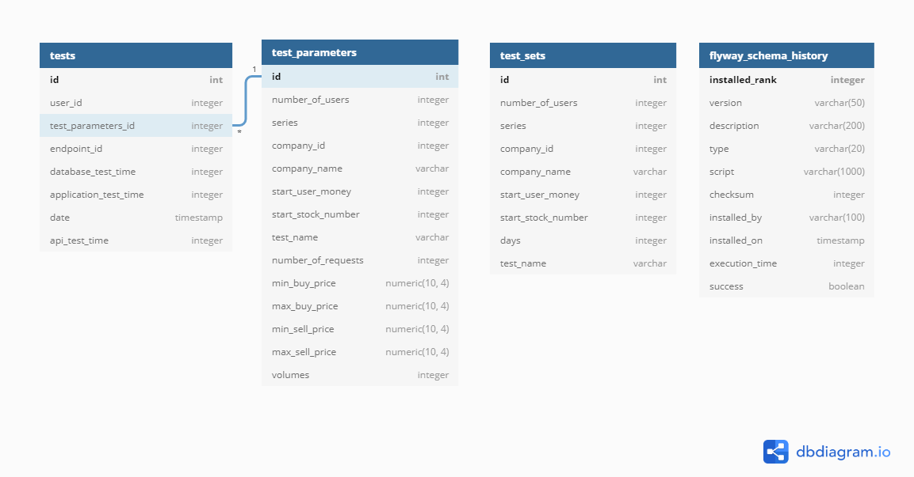

# Exchange Trading Tester
This application simulate real behaviours of stock market. It creates fake transactions and saves stock value companies statistics.
    
## Technologies
- Java 8
- Spring Boot 2.2.6
- Hibernate
- Maven
- Docker
- Swagger

## Endpoints
#### Main endpoints:
- ``/test`` with parameters which are using in simulation:
    * numberUser - amount of users that take part in simulation
    * numberSeries - amount of game ``series`` (quick buy transaction, set buy limit offer, set sell offer limit, quick sell transaction)
    * companyId - company id
    * companyName - company name
    * startUserMoney - primary amount of money which is assigned to all users
    * startStockNumber - primary amount of stock which users buy on beginning of simulation 
    * testName - name test
    * daysNumber - amount of days, simulation starts from today subtract ``daysNumber``. Simulation is repeated for ``daysNumber``. It allows to generate price statistics for longer period of time.
- ``/testParameters`` is used for adding parameters which are set by user
    
    All endpoints are presented on **swagger-ui** (http://localhost:8081/swagger-ui.html)

## Data model
<p align="center"></p>

## Setup

App starts on port 8081. You can starts app using maven, IDE or Docker.
To use Docker, first you have to build project:
```
mvn install
```
Then, you can create custom Docker image which including Exchange-Trading-Tester:
```
docker build -t <image_name>:<tag> .
```
To run application on Docker you must start container:
```
docker run -d -p 8081:8081 <image_name>
```

## Linked repositoris
* [Exchange-Trading-Api](https://github.com/pkwasek08/Exchange-Trading)    
* [Exchange-Trading-App](https://github.com/pkwasek08/Exchange-Trading-App)  
* [Exchange-Trading-DevOps](https://github.com/pkwasek08/Exchange-Trading-DevOps)